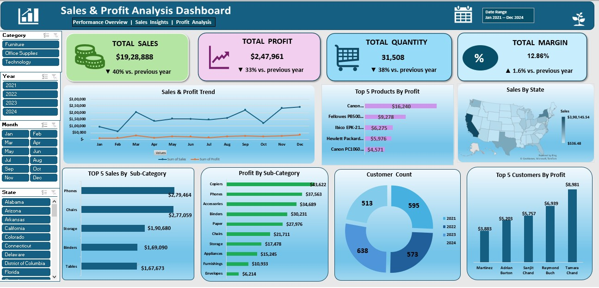

# Sales & Profit Analysis Dashboard (Excel)

An interactive sales dashboard built in Excel using pivot tables, slicers and charts.
Data: retail sales from Jan 2021 to 2024.

## What the dashboard shows
- Total Sales, Total Profit, Total Quantity and Profit Margin
- A "vs. previous year" change on each card that updates with the Year slicer
- Sales & Profit trend by month
- Top 5 products and top 5 customers by profit
- Sales by state (map), Profit by sub-category, Top 5 sales by sub-category
- Customer count by year
- Slicers: Category, Year, Month, State

## Key insights
- Technology has the highest sales (36.5%), but Office Supplies has the best margin (18.0%).
- Furniture sells a lot but its margin is only 2.9%.
- California is the top state (20.2% of sales), followed by New York and Texas.
- Tables lose money overall. Copiers, Phones and Accessories give the most profit.
- Profit margin improved every year, from 10.2% in 2021 to 15.1% in 2024.
- Sales are highest in Nov and Dec and lowest in Jan and Feb.

Note: the 2024 data covers only 8 months, so the 2024 drop in sales vs 2023 is partly because of the missing months.

## Files
- `Sales_and_Profit_Dashboard_Data_01.xlsx` - dataset, pivot tables and the dashboard
- `Dashboard.jpg` - screenshot of the dashboard

## Tools used
Excel, Pivot Tables, Slicers, Charts, GETPIVOTDATA

## How to use
Download the Excel file, open the Dashboard sheet and click the slicers to filter the data.

## Author
Chandana B# Excel-Sales-Profit-Dashboard
Sales &amp; Profit Analysis Dashboard in Excel using pivot tables and slicers
